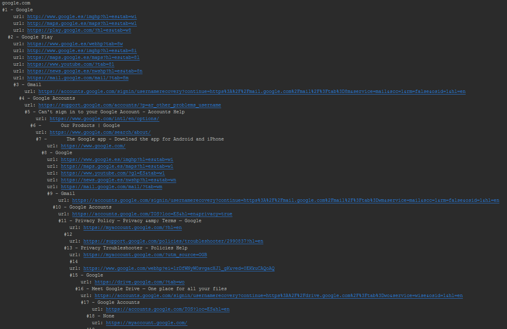

# Scan links
Get all the links in a website: Count and check broken links.

This program prints a hierarchy of the linked urls in a web. Exploring the net :D

Edit the value MAX_LINKS (500 by default) for jumping more (or less) pages during the scan.

* Python, with BeautifoulSoup and requests libraries

Example: scanning the urls at <a hre="google.com">google.com</a>

